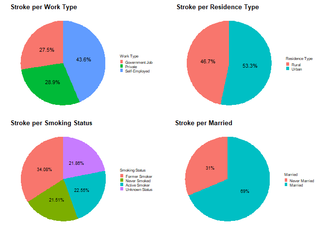

Stroke Data Mining
================
Mateo Forero

Import all necessary libraries

``` r
library(tidyverse)
library(rmarkdown)
library(gridExtra)
library(mice)
library(caret)
library(MLmetrics)
library(MASS)
library(fastDummies)
library(tidymodels)
library(MLeval)
library(themis)
library(doParallel)
```

# Processing Data

First step is to load the data set we are planning to use and
investigate some of its properties. Additionally the ID column is being
dropped and the natural index of the tibble will be used. The decision
is being made to only work with adults. The data set has 856 cases where
the patient is below the age of 18 and of those cases only 2 have had a
stroke (0.23%). The rate of stroke in children is much lower than those
in adults (estimated as 4.6 per 100,000 children), and is commonly
associated with risk factors not captured in this data set (e.g genetic
conditions). This will allow for a more focused study.

``` r
raw_data <- read_csv("healthcare-dataset-stroke-data.csv",show_col_types = FALSE)
raw_data <- dplyr::select(raw_data,-c(id))
adult_data <- filter(raw_data, age >= 18)
```

A quick look at the data shows BMI as a character variable, so it will
be converted to numeric and the rest of the character and binary
variables will be converted to factors. Imputation will be used against
all the null values in the data set later.

``` r
adult_data$bmi <- as.numeric(adult_data$bmi)
```

    ## Warning: NAs introduced by coercion

``` r
adult_data$hypertension <- as.factor(adult_data$hypertension)
adult_data$heart_disease <- as.factor(adult_data$heart_disease)
adult_data$stroke <- as.factor(adult_data$stroke)
adult_data <-adult_data %>% mutate_if(is.character,as.factor)

head(adult_data)
```

    ## # A tibble: 6 x 11
    ##   gender   age hypertension heart_disease ever_married work_type  Residence_type
    ##   <fct>  <dbl> <fct>        <fct>         <fct>        <fct>      <fct>         
    ## 1 Male      67 0            1             Yes          Private    Urban         
    ## 2 Female    61 0            0             Yes          Self-empl~ Rural         
    ## 3 Male      80 0            1             Yes          Private    Rural         
    ## 4 Female    49 0            0             Yes          Private    Urban         
    ## 5 Female    79 1            0             Yes          Self-empl~ Rural         
    ## 6 Male      81 0            0             Yes          Private    Urban         
    ## # ... with 4 more variables: avg_glucose_level <dbl>, bmi <dbl>,
    ## #   smoking_status <fct>, stroke <fct>

Quick summary of stats show: 11.7% have hypertension, 6.46% have heart
disease, and our response variable is only positive for 5.81% of out
data. The average glucose level has a positive skew causing the mean to
be larger than our median.

``` r
summary(adult_data)
```

    ##     gender          age       hypertension heart_disease ever_married
    ##  Female:2576   Min.   :18.0   0:3757       0:3979        No : 901    
    ##  Male  :1677   1st Qu.:36.0   1: 497       1: 275        Yes:3353    
    ##  Other :   1   Median :50.5                                          
    ##                Mean   :50.2                                          
    ##                3rd Qu.:64.0                                          
    ##                Max.   :82.0                                          
    ##                                                                      
    ##          work_type    Residence_type avg_glucose_level      bmi       
    ##  Govt_job     : 651   Rural:2085     Min.   : 55.12    Min.   :11.30  
    ##  Never_worked :   5   Urban:2169     1st Qu.: 77.48    1st Qu.:25.40  
    ##  Private      :2791                  Median : 92.47    Median :29.20  
    ##  Self-employed: 807                  Mean   :108.51    Mean   :30.43  
    ##                                      3rd Qu.:116.14    3rd Qu.:34.20  
    ##                                      Max.   :271.74    Max.   :92.00  
    ##                                                        NA's   :181    
    ##          smoking_status stroke  
    ##  formerly smoked: 860   0:4007  
    ##  never smoked   :1752   1: 247  
    ##  smokes         : 780           
    ##  Unknown        : 862           
    ##                                 
    ##                                 
    ## 

Our only numeric column with missing values is BMI. Approximately 4.25%
of the cases are missing BMI values. Additionally we have 1 ‘Other’
under gender and 862 ‘Unknown’ under smoking_status. To simplify the
model we will assume gender is categorizing biological sex and will
assign the “Other” to Female which is the most common gender in our data
set. I’ll treat the ‘Unknown’ as a valid category of smoking_status.
Under work_type we have 5 ‘Never_worked’ which comprises of 0.12% of the
total cases so they will be changed to Private. These were more
prevalent when children were still being considered in our model.

We will be utilizing cross-validation, and imputation of BMI will be
applied for each fold to prevent data leakage. Data leakage is assumed
to be negligible for the Gender and Work Type variable changes since
they constitute such a small number of cases changed.

``` r
adult_data$gender[which(adult_data$gender == "Other")] <- "Female"
adult_data$gender <- factor(adult_data$gender)
adult_data$work_type[which(adult_data$work_type == 'Never_worked')] <- "Private"
adult_data$work_type <- factor(adult_data$work_type)
```

# Visualizing the data

We will break our data into groups we care to analyze further with
graphs

``` r
ht_data <- adult_data[which(adult_data$hypertension == 1),]
no_ht_data <- adult_data[which(adult_data$hypertension == 0),]
hd_data <- adult_data[which(adult_data$heart_disease == 1),]
no_hd_data <- adult_data[which(adult_data$heart_disease == 0),]
```

The first set of graphs will investigate how big of an influence
hypertension is on having a stroke. Because only 11.7% of the cases have
hypertension we will graph these separately. We also separate genders to
see if there is a major difference. This same exercise will be performed
on heart disease.

``` r
grid.arrange(nohyper_plot, hyper_plot)
```

<!-- -->

``` r
grid.arrange(noheartd_plot,heartd_plot)
```

<!-- -->

``` r
grid.arrange(age_plot,gluc_plot,bmi_plot,ncol = 2,nrow = 2)
```

    ## Warning: Removed 181 rows containing non-finite values (stat_boxplot).

<!-- -->

Next we will look at whether we see a difference in the categorical
values and their average rate of stroke.

``` r
grid.arrange(work_pie, res_pie, smoke_pie, married_pie,nrow = 2, ncol = 2)
```

<!-- -->

# Model Pre-Processing

As this point we have all the visual inference about our data and how it
relates to the response variable. Although we will tune our models
individually, to write efficient code we will automate our data
pre-processing so we can train and test our models with ease.

I chose to impute our missing BMI values using a random forest
imputation method. This method performs very well when the variable
being imputed is normally distributed. As an example, the density plot
of the predicted values vs the original data set is included. The mean
of the 5 simulations are used to give a value to our new data set.

``` r
mice_result <- mice(adult_data,method = 'rf',seed = 575)
```

``` r
complete_data <- complete(mice_result)
densityplot(mice_result)
```

<!-- -->

I’ll now create dummy variables to represent the categorical data to
preform a smote procedure later in our cross validation. Additionally
the data will be split 85/15 used stratified indexing to have a test set
to determine final model potential.

``` r
set.seed(575)
dummy_data <- dummy_cols(complete_data,
                    select_columns = c("gender",
                                       "hypertension",
                                       "heart_disease",
                                       'ever_married',
                                       'work_type',
                                       "Residence_type",
                                       "smoking_status"),
                    remove_first_dummy = TRUE,
                    remove_selected_columns = TRUE)

dummy_data$stroke <- recode_factor(dummy_data$stroke, "0" = "No_Stroke", "1" = "Stroke")

trainIndex <- createDataPartition(dummy_data$stroke, p = .85,
                                  list = FALSE,
                                  times = 1)
dummy_data <- dummy_data[ trainIndex,]
test_data <- dummy_data[-trainIndex,]
```

## Model 1: Logistic Regression
A Step AIC algorithm is run to find the best variables to use. A prelimiary model using the entire dataset will be used to determine which predictors are statistically relevant to our response then CV will be done with the chosen parameters.

``` r
smote_log_model_1 <- recipe(stroke~., data = dummy_data, seed = 575) %>%
  step_smote(stroke) %>%
  prep()

log_param <- glm(stroke~.,family = binomial(link = logit),data = smote_log_model_1$template)

step.model <- stepAIC(log_param,direction = 'both',trace = FALSE)
summary(step.model)
```

    ## 
    ## Call:
    ## glm(formula = stroke ~ age + avg_glucose_level + gender_Male + 
    ##     hypertension_1 + heart_disease_1 + ever_married_Yes + `work_type_Self-employed` + 
    ##     Residence_type_Urban + `smoking_status_never smoked` + smoking_status_Unknown, 
    ##     family = binomial(link = logit), data = smote_log_model_1$template)
    ## 
    ## Deviance Residuals: 
    ##      Min        1Q    Median        3Q       Max  
    ## -2.57037  -0.76197   0.03513   0.77630   2.14833  
    ## 
    ## Coefficients:
    ##                                 Estimate Std. Error z value Pr(>|z|)    
    ## (Intercept)                   -5.2357574  0.1746989 -29.970  < 2e-16 ***
    ## age                            0.0832302  0.0024595  33.841  < 2e-16 ***
    ## avg_glucose_level              0.0029383  0.0005656   5.195 2.04e-07 ***
    ## gender_Male                    0.1766414  0.0673361   2.623 0.008709 ** 
    ## hypertension_1                 0.6860472  0.0872994   7.859 3.89e-15 ***
    ## heart_disease_1                0.4220692  0.1103621   3.824 0.000131 ***
    ## ever_married_Yes              -0.1650830  0.1054184  -1.566 0.117354    
    ## `work_type_Self-employed`     -0.2988333  0.0810664  -3.686 0.000228 ***
    ## Residence_type_Urban           0.1465915  0.0661725   2.215 0.026740 *  
    ## `smoking_status_never smoked` -0.4391841  0.0742031  -5.919 3.25e-09 ***
    ## smoking_status_Unknown        -0.2661649  0.0912270  -2.918 0.003527 ** 
    ## ---
    ## Signif. codes:  0 '***' 0.001 '**' 0.01 '*' 0.05 '.' 0.1 ' ' 1
    ## 
    ## (Dispersion parameter for binomial family taken to be 1)
    ## 
    ##     Null deviance: 9443.4  on 6811  degrees of freedom
    ## Residual deviance: 6797.9  on 6801  degrees of freedom
    ## AIC: 6819.9
    ## 
    ## Number of Fisher Scoring iterations: 5

To avoid dropping partial categories, the factors for work type and
smoker status will be combined. Work type will now have 2 levels to
describe someone who is self employed vs works for another entity.
Smoking will be broken up into 3 groups, was/is a smoker, never smoked,
or unknown.

``` r
logistic_complete <- complete(mice_result)
logistic_complete$work_type <- fct_collapse(complete_data$work_type,
                                        GP = c("Private","Govt_job"),
                                        self_employed = 'Self-employed')
logistic_complete$smoking_status <- fct_collapse(complete_data$smoking_status,
                                        smoked = c("formerly smoked","smokes"),
                                        never_smoked = 'never smoked')


log_dummy <- dummy_cols(logistic_complete,
                    select_columns = c("gender",
                                       "hypertension",
                                       "heart_disease",
                                       'ever_married',
                                       'work_type',
                                       "Residence_type",
                                       "smoking_status"),
                    remove_first_dummy = TRUE,
                    remove_selected_columns = TRUE)

log_dummy$stroke <- recode_factor(log_dummy$stroke, "0" = "No_Stroke", "1" = "Stroke")
```

A second iteration to check for statistically significant parameters
will be done.

``` r
smote_log_model_2 <- recipe(stroke~., data = log_dummy, seed = 575) %>%
  step_smote(stroke) %>%
  prep()

log_param <- glm(stroke~.,family = binomial(link = logit),data = smote_log_model_2$template)

step.model <- stepAIC(log_param,direction = 'both',trace = FALSE)
summary(step.model)
```

    ## 
    ## Call:
    ## glm(formula = stroke ~ age + avg_glucose_level + hypertension_1 + 
    ##     heart_disease_1 + ever_married_Yes + work_type_self_employed + 
    ##     Residence_type_Urban + smoking_status_never_smoked + smoking_status_Unknown, 
    ##     family = binomial(link = logit), data = smote_log_model_2$template)
    ## 
    ## Deviance Residuals: 
    ##      Min        1Q    Median        3Q       Max  
    ## -2.52830  -0.76179   0.04506   0.77731   2.23764  
    ## 
    ## Coefficients:
    ##                              Estimate Std. Error z value Pr(>|z|)    
    ## (Intercept)                 -5.205009   0.157665 -33.013  < 2e-16 ***
    ## age                          0.083177   0.002230  37.296  < 2e-16 ***
    ## avg_glucose_level            0.003759   0.000521   7.214 5.44e-13 ***
    ## hypertension_1               0.569043   0.081061   7.020 2.22e-12 ***
    ## heart_disease_1              0.394854   0.101271   3.899 9.66e-05 ***
    ## ever_married_Yes            -0.160952   0.097356  -1.653   0.0983 .  
    ## work_type_self_employed     -0.466483   0.074939  -6.225 4.82e-10 ***
    ## Residence_type_Urban         0.118102   0.060400   1.955   0.0505 .  
    ## smoking_status_never_smoked -0.449296   0.067748  -6.632 3.31e-11 ***
    ## smoking_status_Unknown      -0.214257   0.083500  -2.566   0.0103 *  
    ## ---
    ## Signif. codes:  0 '***' 0.001 '**' 0.01 '*' 0.05 '.' 0.1 ' ' 1
    ## 
    ## (Dispersion parameter for binomial family taken to be 1)
    ## 
    ##     Null deviance: 11109.8  on 8013  degrees of freedom
    ## Residual deviance:  8023.9  on 8004  degrees of freedom
    ## AIC: 8043.9
    ## 
    ## Number of Fisher Scoring iterations: 5

This will control how I train my models. I intend to CV with 10 folds.
They will all be centered and scaled and SMOTE will be used to balance
the response variables in each split, thus preventing data leakage.

``` r
tc_log <- trainControl(method = 'cv',
                   number = 10,
                   savePredictions = TRUE,
                   classProbs = TRUE,
                   sampling = 'smote',
                   )
```

CV with smote sampling will be run with 10 folds. The Logistic formula
found in the previous step will be used.

``` r
set.seed(575)
t <- Sys.time()

Logistic_model <- train(stroke ~.,
               data = log_dummy,
               trControl = tc_log,
               method = 'glmStepAIC',
               family = "binomial",
               trace = FALSE,
               metric = 'Kappa'
               )

Sys.time() - t
```

    ## Time difference of 12.56863 secs

This is our final Logistic Model. Metrics will be discussed in the next
section

``` r
summary(Logistic_model$finalModel)
```

    ## 
    ## Call:
    ## NULL
    ## 
    ## Deviance Residuals: 
    ##      Min        1Q    Median        3Q       Max  
    ## -2.51423  -0.76310   0.04405   0.77988   2.24897  
    ## 
    ## Coefficients:
    ##                               Estimate Std. Error z value Pr(>|z|)    
    ## (Intercept)                 -5.2290082  0.1581857 -33.056  < 2e-16 ***
    ## age                          0.0827976  0.0022304  37.123  < 2e-16 ***
    ## avg_glucose_level            0.0038269  0.0005198   7.363 1.80e-13 ***
    ## hypertension_1               0.5792909  0.0813110   7.124 1.05e-12 ***
    ## heart_disease_1              0.3841254  0.1008687   3.808  0.00014 ***
    ## ever_married_Yes            -0.1576771  0.0976831  -1.614  0.10649    
    ## work_type_self_employed     -0.4150553  0.0748371  -5.546 2.92e-08 ***
    ## Residence_type_Urban         0.1533649  0.0604867   2.536  0.01123 *  
    ## smoking_status_never_smoked -0.4528094  0.0677945  -6.679 2.40e-11 ***
    ## smoking_status_Unknown      -0.1609230  0.0830756  -1.937  0.05274 .  
    ## ---
    ## Signif. codes:  0 '***' 0.001 '**' 0.01 '*' 0.05 '.' 0.1 ' ' 1
    ## 
    ## (Dispersion parameter for binomial family taken to be 1)
    ## 
    ##     Null deviance: 11109.8  on 8013  degrees of freedom
    ## Residual deviance:  8039.5  on 8004  degrees of freedom
    ## AIC: 8059.5
    ## 
    ## Number of Fisher Scoring iterations: 5

``` r
confusionMatrix(Logistic_model,'none')
```

    ## Cross-Validated (10 fold) Confusion Matrix 
    ## 
    ## (entries are un-normalized aggregated counts)
    ##  
    ##            Reference
    ## Prediction  No_Stroke Stroke
    ##   No_Stroke      2909     58
    ##   Stroke         1098    189
    ##                             
    ##  Accuracy (average) : 0.7283

## Model 2: Random Forest Classifier.

To simplify the remaining model creations and keep them all consistent,
the work and smoking factor collapse will be performed on the adult
dataset

``` r
complete_data <- complete(mice_result)
complete_data$work_type <- fct_collapse(complete_data$work_type,
                                        GP = c("Private","Govt_job"),
                                        self_employed = 'Self-employed')
complete_data$smoking_status <- fct_collapse(complete_data$smoking_status,
                                        smoked = c("formerly smoked","smokes"),
                                        never_smoked = 'never smoked')

set.seed(575)
dummy_data <- dummy_cols(complete_data,
                    select_columns = c("gender",
                                       "hypertension",
                                       "heart_disease",
                                       'ever_married',
                                       'work_type',
                                       "Residence_type",
                                       "smoking_status"),
                    remove_first_dummy = TRUE,
                    remove_selected_columns = TRUE)

dummy_data$stroke <- recode_factor(dummy_data$stroke, "0" = "No_Stroke", "1" = "Stroke")

trainIndex <- createDataPartition(dummy_data$stroke, p = .85,
                                  list = FALSE,
                                  times = 1)
dummy_data <- dummy_data[ trainIndex,]
test_data <- dummy_data[-trainIndex,]
```

RF does not need scaling of parameters so it was removed. I will tune on
number of random parameters to use (‘mtry’). Parallel computing is being
utilized to speed up computation time.

``` r
tc_rf1 <- trainControl(method = 'cv',
                   number = 10,
                   sampling = 'smote',
                   search = 'grid',
                   allowParallel = T,
                   )
registerDoParallel(detectCores()-2)

tuneGrid1 <- expand.grid(.mtry = c(1,3,5,7,9))
```

``` r
t <- Sys.time()
set.seed(575)
RF_model1 <- train(stroke ~.,
               data = dummy_data,
               trControl = tc_rf1,
               importance = TRUE,
               method = 'rf',
               tuneGrid = tuneGrid1,
               ntree = 1000,
               metric = 'Kappa'
               )

Sys.time() - t
```

    ## Time difference of 2.06646 mins

A model using the best hyper parameter (mtry =1) is build and run
through cv. This model will be used for metrics in the next section.

``` r
tc_rf2 <- trainControl(method = 'cv',
                   number = 10,
                   savePredictions = 'final',
                   classProbs = TRUE,
                   sampling = 'smote',
                   search = 'grid',
                   allowParallel = T,
                   summaryFunction = prSummary
                   )

tuneGrid2 <- expand.grid(.mtry = c(1))
```

``` r
t <- Sys.time()
set.seed(575)
RF_model2 <- train(stroke ~.,
               data = dummy_data,
               trControl = tc_rf2,
               importance = TRUE,
               method = 'rf',
               tuneGrid = tuneGrid2,
               ntree = 1000,
               metric = 'AUC'
               )

Sys.time() - t
```

    ## Time difference of 28.78889 secs

``` r
RF_model2$results
```

    ##   mtry      AUC Precision    Recall         F       AUCSD PrecisionSD
    ## 1    1 0.970814 0.9456187 0.9800362 0.9625012 0.007920892 0.002681114
    ##      RecallSD         FSD
    ## 1 0.008036145 0.003806743

This is our final RF. Metrics will be discussed in the next section

``` r
RF_model2$finalModel$confusion
```

    ##           No_Stroke Stroke class.error
    ## No_Stroke      3328     78  0.02290076
    ## Stroke          394   3012  0.11567821

## Model 3: Gradient Boosting

Gradient boosting will now be used

``` r
boost_grid <- expand.grid(n.trees = c(1000,2000),
                          interaction.depth=c(1:5),
                          shrinkage=seq(0.005,01,length.out = 10), n.minobsinnode=c(10))

tc_boost <- trainControl(method = 'cv',
                   number = 5,
                   savePredictions = TRUE,
                   classProbs = TRUE,
                   sampling = 'smote',
                   search = 'grid',
                   allowParallel = T 
                   )
```

Model Training

``` r
t <- Sys.time()
set.seed(575)
GB_Model <- train(stroke~.,data = dummy_data,
                  method = "gbm",
                  metric = 'Kappa',
                  trControl = tc_boost,
                  verbose = FALSE,
                  tuneGrid = boost_grid)
Sys.time() - t
```

    ## Time difference of 6.044206 mins

``` r
grid.table(round(head(GB_Model$results[order(GB_Model$results$Kappa,decreasing = TRUE),]),3))
```


A final GB model will be created using the best tuning

``` r
boost_grid2 <- expand.grid(n.trees = c(2000),
                          interaction.depth=c(1),
                          shrinkage= c(0.005), n.minobsinnode=c(10))

tc_boost2 <- trainControl(method = 'cv',
                   number = 10,
                   savePredictions = 'final',
                   classProbs = TRUE,
                   sampling = 'smote',
                   search = 'grid',
                   allowParallel = T 
                   )
```

Model Training

``` r
t <- Sys.time()
set.seed(575)
GB_Model2 <- train(stroke~.,data = dummy_data,
                  method = "gbm",
                  metric = 'Kappa',
                  trControl = tc_boost2,
                  verbose = FALSE,
                  tuneGrid = boost_grid2)
Sys.time() - t
```

    ## Time difference of 17.07394 secs


``` r
confusionMatrix(GB_Model2,'none')
```

    ## Cross-Validated (10 fold) Confusion Matrix 
    ## 
    ## (entries are un-normalized aggregated counts)
    ##  
    ##            Reference
    ## Prediction  No_Stroke Stroke
    ##   No_Stroke      3031    135
    ##   Stroke          375     75
    ##                            
    ##  Accuracy (average) : 0.859

``` r
boost_Metrics <- evalm(GB_Model2,optimise = 'F1',showplots = FALSE)
```

    ## ***MLeval: Machine Learning Model Evaluation***

    ## Input: caret train function object

    ## Not averaging probs.

    ## Group 1 type: cv

    ## Observations: 3616

    ## Number of groups: 1

    ## Observations per group: 3616

    ## Positive: Stroke

    ## Negative: No_Stroke

    ## Group: Group 1

    ## Positive: 210

    ## Negative: 3406

    ## ***Performance Metrics***

    ## Group 1 Optimal F1 score = 0.253138075313808

    ## Group 1 AUC-ROC = 0.79

``` r
boost_Metrics$stdres
```

    ## $`Group 1`
    ##                 Score        CI
    ## SENS            0.357  0.3-0.42
    ## SPEC            0.890  0.88-0.9
    ## MCC             0.175      <NA>
    ## Informedness    0.247      <NA>
    ## PREC            0.167  0.14-0.2
    ## NPV             0.957 0.95-0.96
    ## FPR             0.110      <NA>
    ## F1              0.227      <NA>
    ## TP             75.000      <NA>
    ## FP            375.000      <NA>
    ## TN           3031.000      <NA>
    ## FN            135.000      <NA>
    ## AUC-ROC         0.790 0.75-0.83
    ## AUC-PR          0.160      <NA>
    ## AUC-PRG         0.010      <NA>

# Metrics and Model Selection

This Function will determine what the best threshold for the models are
when optimized by the F-Beta_Measure. In this particular case, I am most
interested in F-2_Measure to add more important to recall to avoid false
negative as much as possible.

``` r
Fb_thresh <- function(model, Beta=1){
  prob_true <- model$pred$Stroke
  observed <- model$pred$obs
  thrs  <- seq(0.05,.95,length.out = 200)
  fb_measure <- rep(0,200)
  thrs_f_table <- data.frame(thrs,fb_measure)
  
  for(i in 1:length(fb_measure)){
    pred_X <- ifelse(prob_true >= thrs[i],"Stroke", "No_Stroke")
    
    thrs_f_table[i,2] <- FBeta_Score(observed, pred_X,
                                     beta = Beta,
                                     positive = "Stroke")
  }
  thrs_f_table[is.na(thrs_f_table)] <- 0
  max_thresh <- thrs_f_table[which(max(thrs_f_table$fb_measure) == thrs_f_table$fb_measure), ] 
  
  Return_list <- list(max_thresh,thrs_f_table)
  return(Return_list)
}
```

The function returns the best threshold and a data frame of all the
points tested. In particular the cross validation models are used to
determine the best threshold to use

This will adjust our stroke probability using the “Population rate” seen
in our data set.

``` r
prob_fix <- function(x){
  y <- (x*(0.058063/0.5))/(x*(0.058063/0.5) +
       (1-x)*((1-0.058063)/0.5))
  return(y)
}
```

``` r
Log_thres <- Fb_thresh(Logistic_model,2)
RF_thres <- Fb_thresh(RF_model2,2)
GB_thres <- Fb_thresh(GB_Model2,2)

Model_thres <- data.frame(Log_thres[[2]][1],
                          Log_thres[[2]][2],
                          RF_thres[[2]][2],
                          GB_thres[[2]][2])

names(Model_thres)[1] <- "Threshold"
names(Model_thres)[2] <- "Log_F2_Score"
names(Model_thres)[3] <- "RF_F2_Score" 
names(Model_thres)[4] <- "GB_F2_Score"


ggplot(data = Model_thres) +
  geom_line(mapping = aes(x = Threshold, y = Log_F2_Score,
                             color = "Log_F2_Score"), lwd = 1.5) +
  geom_point(data = Log_thres[[1]],aes(x = thrs, y = fb_measure)) +
  geom_segment(data = Log_thres[[1]],
               aes(x = thrs, xend = thrs, y = fb_measure, yend = 0),
               linetype = "dashed",lwd = 1) +
  geom_text(data = Log_thres[[1]],
            aes(x = thrs, y = fb_measure, label = round(thrs,3)),
            vjust = -1, hjust = 1) +
  geom_text(data = Log_thres[[1]],
            aes(x = thrs, y = fb_measure, label = round(fb_measure,3)),
            vjust = -1, hjust = -0.2) +
  geom_line(mapping = aes(x = Threshold, y = RF_F2_Score,
                             color = "RF_F2_Score"), lwd = 1.5) +
  geom_point(data = RF_thres[[1]],aes(x = thrs, y = fb_measure)) +
  geom_segment(data = RF_thres[[1]],
               aes(x = thrs, xend = thrs, y = fb_measure, yend = 0),
               linetype = "dashed",lwd = 1) +
  geom_text(data = RF_thres[[1]],
            aes(x = thrs, y = fb_measure, label = round(thrs,3)),
            vjust = -1.5, hjust = 1) +
  geom_text(data = RF_thres[[1]],
            aes(x = thrs, y = fb_measure, label = round(fb_measure,3)),
            vjust = -1.5, hjust = -0.2) +
  geom_line(mapping = aes(x = Threshold, y = GB_F2_Score,
                             color = "GB_F2_Score"), lwd = 1.5) +
  geom_point(data = GB_thres[[1]],aes(x = thrs, y = fb_measure)) +
  geom_segment(data = GB_thres[[1]],
               aes(x = thrs, xend = thrs, y = fb_measure, yend = 0),
               linetype = "dashed",lwd = 1) +
  geom_text(data = GB_thres[[1]],
            aes(x = thrs, y = fb_measure, label = round(thrs,3)),
            vjust = -0.2, hjust = 1.2) +
  geom_text(data = GB_thres[[1]],
            aes(x = thrs, y = fb_measure, label = round(fb_measure,3)),
            vjust = -0.2, hjust = 0) +
  scale_color_manual(name = "Legend", values = c("Log_F2_Score" = "darkblue",
                                                 "RF_F2_Score" = "red",
                                                 "GB_F2_Score" = "black")) +
  ylim(0,0.5) +
  ggtitle("F2 Measure vs Threshold")  + ylab("F2 Measure")
```

<!-- -->

Going back to the test data, it is now split into X_test and Y_test.

``` r
X_test <- test_data[,-4]
Y_test <- test_data[, 4]
```

Probabilities are being determined to allow for threshold optimization.

``` r
log_prob <- predict(Logistic_model,X_test,type = 'prob')
RF_prob <- predict(RF_model2,X_test,type = 'prob')
GB_prob <- predict(GB_Model2,X_test,type = 'prob')

log_predic <- rep(0,length.out = nrow(X_test))
RF_predic <- rep(0,length.out = nrow(X_test))
GB_predic <- rep(0,length.out = nrow(X_test))

for(i in 1:nrow(X_test)){
  log_predic[i] <- ifelse(log_prob$Stroke[i] > Log_thres[[1]][1],'Stroke','No_Stroke')
  RF_predic[i] <- ifelse(RF_prob$Stroke[i] > RF_thres[[1]][1],'Stroke','No_Stroke')
  GB_predic[i] <- ifelse(GB_prob$Stroke[i] > GB_thres[[1]][1],'Stroke','No_Stroke')
}
```

``` r
message("Logistic Model")
```

    ## Logistic Model

``` r
ConfusionMatrix(log_predic,Y_test)
```

    ##            y_pred
    ## y_true      No_Stroke Stroke
    ##   No_Stroke       392    118
    ##   Stroke            9     22

``` r
FBeta_Score(Y_test,y_pred = log_predic,positive = "Stroke",2)
```

    ## [1] 0.4166667

``` r
message("Random Forest Model")
```

    ## Random Forest Model

``` r
ConfusionMatrix(RF_predic,Y_test)
```

    ##            y_pred
    ## y_true      No_Stroke Stroke
    ##   No_Stroke       351    159
    ##   Stroke            5     26

``` r
FBeta_Score(Y_test,y_pred = RF_predic,positive = "Stroke",2)
```

    ## [1] 0.420712

``` r
message("Gradient Boosting Model")
```

    ## Gradient Boosting Model

``` r
ConfusionMatrix(GB_predic,Y_test)
```

    ##            y_pred
    ## y_true      No_Stroke Stroke
    ##   No_Stroke       390    120
    ##   Stroke            8     23

``` r
FBeta_Score(Y_test,y_pred = GB_predic,positive = "Stroke",2)
```

    ## [1] 0.4307116

The function evalm from MLevals can also be used to compare the final
models created using CV.

``` r
Model_Metrics <- evalm(list(Logistic_model, RF_model2, GB_Model2),
                     gnames=c('Logistic','RF',"GB"),
                     rlinethick=0.8,
                     fsize=13,
                     plots='pr',
                     silent = TRUE,
                     positive = 'Stroke',
                     optimise = 'F1')
```

<!-- -->

Although the models are not performing optimally, they do a good job at
predicting a stroke. In this case FN have a large impact, where as a FP
is common in the medical field. Our model is best thought as a way to
catch at-risk patients

## Extra Information

It’s possible to extract variable importance

``` r
#library(randomForestExplainer)
summary(GB_Model2)
```

    ##                                                     var    rel.inf
    ## age                                                 age 43.5698216
    ## Residence_type_Urban               Residence_type_Urban 13.7472315
    ## gender_Male                                 gender_Male 12.9065208
    ## hypertension_1                           hypertension_1  9.4558783
    ## smoking_status_never_smoked smoking_status_never_smoked  8.2655551
    ## work_type_self_employed         work_type_self_employed  6.3555075
    ## heart_disease_1                         heart_disease_1  2.8534949
    ## smoking_status_Unknown           smoking_status_Unknown  2.5627799
    ## ever_married_Yes                       ever_married_Yes  0.2832104
    ## avg_glucose_level                     avg_glucose_level  0.0000000
    ## bmi                                                 bmi  0.0000000

``` r
#randomForestExplainer::explain_forest(RF_model2$finalModel)
```

Table output for Logistic Regression

``` r
library(gtsummary)
```

    ## 
    ## Attaching package: 'gtsummary'

    ## The following object is masked from 'package:recipes':
    ## 
    ##     all_numeric

    ## The following object is masked from 'package:MASS':
    ## 
    ##     select

``` r
Logistic_model$finalModel %>%
  tbl_regression(exponentiate = TRUE) %>%
  add_glance_source_note() %>%
  bold_labels()
```

<div id="adclcyjlzz" style="overflow-x:auto;overflow-y:auto;width:auto;height:auto;">
<style>html {
  font-family: -apple-system, BlinkMacSystemFont, 'Segoe UI', Roboto, Oxygen, Ubuntu, Cantarell, 'Helvetica Neue', 'Fira Sans', 'Droid Sans', Arial, sans-serif;
}

#adclcyjlzz .gt_table {
  display: table;
  border-collapse: collapse;
  margin-left: auto;
  margin-right: auto;
  color: #333333;
  font-size: 16px;
  font-weight: normal;
  font-style: normal;
  background-color: #FFFFFF;
  width: auto;
  border-top-style: solid;
  border-top-width: 2px;
  border-top-color: #A8A8A8;
  border-right-style: none;
  border-right-width: 2px;
  border-right-color: #D3D3D3;
  border-bottom-style: solid;
  border-bottom-width: 2px;
  border-bottom-color: #A8A8A8;
  border-left-style: none;
  border-left-width: 2px;
  border-left-color: #D3D3D3;
}

#adclcyjlzz .gt_heading {
  background-color: #FFFFFF;
  text-align: center;
  border-bottom-color: #FFFFFF;
  border-left-style: none;
  border-left-width: 1px;
  border-left-color: #D3D3D3;
  border-right-style: none;
  border-right-width: 1px;
  border-right-color: #D3D3D3;
}

#adclcyjlzz .gt_title {
  color: #333333;
  font-size: 125%;
  font-weight: initial;
  padding-top: 4px;
  padding-bottom: 4px;
  border-bottom-color: #FFFFFF;
  border-bottom-width: 0;
}

#adclcyjlzz .gt_subtitle {
  color: #333333;
  font-size: 85%;
  font-weight: initial;
  padding-top: 0;
  padding-bottom: 6px;
  border-top-color: #FFFFFF;
  border-top-width: 0;
}

#adclcyjlzz .gt_bottom_border {
  border-bottom-style: solid;
  border-bottom-width: 2px;
  border-bottom-color: #D3D3D3;
}

#adclcyjlzz .gt_col_headings {
  border-top-style: solid;
  border-top-width: 2px;
  border-top-color: #D3D3D3;
  border-bottom-style: solid;
  border-bottom-width: 2px;
  border-bottom-color: #D3D3D3;
  border-left-style: none;
  border-left-width: 1px;
  border-left-color: #D3D3D3;
  border-right-style: none;
  border-right-width: 1px;
  border-right-color: #D3D3D3;
}

#adclcyjlzz .gt_col_heading {
  color: #333333;
  background-color: #FFFFFF;
  font-size: 100%;
  font-weight: normal;
  text-transform: inherit;
  border-left-style: none;
  border-left-width: 1px;
  border-left-color: #D3D3D3;
  border-right-style: none;
  border-right-width: 1px;
  border-right-color: #D3D3D3;
  vertical-align: bottom;
  padding-top: 5px;
  padding-bottom: 6px;
  padding-left: 5px;
  padding-right: 5px;
  overflow-x: hidden;
}

#adclcyjlzz .gt_column_spanner_outer {
  color: #333333;
  background-color: #FFFFFF;
  font-size: 100%;
  font-weight: normal;
  text-transform: inherit;
  padding-top: 0;
  padding-bottom: 0;
  padding-left: 4px;
  padding-right: 4px;
}

#adclcyjlzz .gt_column_spanner_outer:first-child {
  padding-left: 0;
}

#adclcyjlzz .gt_column_spanner_outer:last-child {
  padding-right: 0;
}

#adclcyjlzz .gt_column_spanner {
  border-bottom-style: solid;
  border-bottom-width: 2px;
  border-bottom-color: #D3D3D3;
  vertical-align: bottom;
  padding-top: 5px;
  padding-bottom: 5px;
  overflow-x: hidden;
  display: inline-block;
  width: 100%;
}

#adclcyjlzz .gt_group_heading {
  padding: 8px;
  color: #333333;
  background-color: #FFFFFF;
  font-size: 100%;
  font-weight: initial;
  text-transform: inherit;
  border-top-style: solid;
  border-top-width: 2px;
  border-top-color: #D3D3D3;
  border-bottom-style: solid;
  border-bottom-width: 2px;
  border-bottom-color: #D3D3D3;
  border-left-style: none;
  border-left-width: 1px;
  border-left-color: #D3D3D3;
  border-right-style: none;
  border-right-width: 1px;
  border-right-color: #D3D3D3;
  vertical-align: middle;
}

#adclcyjlzz .gt_empty_group_heading {
  padding: 0.5px;
  color: #333333;
  background-color: #FFFFFF;
  font-size: 100%;
  font-weight: initial;
  border-top-style: solid;
  border-top-width: 2px;
  border-top-color: #D3D3D3;
  border-bottom-style: solid;
  border-bottom-width: 2px;
  border-bottom-color: #D3D3D3;
  vertical-align: middle;
}

#adclcyjlzz .gt_from_md > :first-child {
  margin-top: 0;
}

#adclcyjlzz .gt_from_md > :last-child {
  margin-bottom: 0;
}

#adclcyjlzz .gt_row {
  padding-top: 8px;
  padding-bottom: 8px;
  padding-left: 5px;
  padding-right: 5px;
  margin: 10px;
  border-top-style: solid;
  border-top-width: 1px;
  border-top-color: #D3D3D3;
  border-left-style: none;
  border-left-width: 1px;
  border-left-color: #D3D3D3;
  border-right-style: none;
  border-right-width: 1px;
  border-right-color: #D3D3D3;
  vertical-align: middle;
  overflow-x: hidden;
}

#adclcyjlzz .gt_stub {
  color: #333333;
  background-color: #FFFFFF;
  font-size: 100%;
  font-weight: initial;
  text-transform: inherit;
  border-right-style: solid;
  border-right-width: 2px;
  border-right-color: #D3D3D3;
  padding-left: 12px;
}

#adclcyjlzz .gt_summary_row {
  color: #333333;
  background-color: #FFFFFF;
  text-transform: inherit;
  padding-top: 8px;
  padding-bottom: 8px;
  padding-left: 5px;
  padding-right: 5px;
}

#adclcyjlzz .gt_first_summary_row {
  padding-top: 8px;
  padding-bottom: 8px;
  padding-left: 5px;
  padding-right: 5px;
  border-top-style: solid;
  border-top-width: 2px;
  border-top-color: #D3D3D3;
}

#adclcyjlzz .gt_grand_summary_row {
  color: #333333;
  background-color: #FFFFFF;
  text-transform: inherit;
  padding-top: 8px;
  padding-bottom: 8px;
  padding-left: 5px;
  padding-right: 5px;
}

#adclcyjlzz .gt_first_grand_summary_row {
  padding-top: 8px;
  padding-bottom: 8px;
  padding-left: 5px;
  padding-right: 5px;
  border-top-style: double;
  border-top-width: 6px;
  border-top-color: #D3D3D3;
}

#adclcyjlzz .gt_striped {
  background-color: rgba(128, 128, 128, 0.05);
}

#adclcyjlzz .gt_table_body {
  border-top-style: solid;
  border-top-width: 2px;
  border-top-color: #D3D3D3;
  border-bottom-style: solid;
  border-bottom-width: 2px;
  border-bottom-color: #D3D3D3;
}

#adclcyjlzz .gt_footnotes {
  color: #333333;
  background-color: #FFFFFF;
  border-bottom-style: none;
  border-bottom-width: 2px;
  border-bottom-color: #D3D3D3;
  border-left-style: none;
  border-left-width: 2px;
  border-left-color: #D3D3D3;
  border-right-style: none;
  border-right-width: 2px;
  border-right-color: #D3D3D3;
}

#adclcyjlzz .gt_footnote {
  margin: 0px;
  font-size: 90%;
  padding: 4px;
}

#adclcyjlzz .gt_sourcenotes {
  color: #333333;
  background-color: #FFFFFF;
  border-bottom-style: none;
  border-bottom-width: 2px;
  border-bottom-color: #D3D3D3;
  border-left-style: none;
  border-left-width: 2px;
  border-left-color: #D3D3D3;
  border-right-style: none;
  border-right-width: 2px;
  border-right-color: #D3D3D3;
}

#adclcyjlzz .gt_sourcenote {
  font-size: 90%;
  padding: 4px;
}

#adclcyjlzz .gt_left {
  text-align: left;
}

#adclcyjlzz .gt_center {
  text-align: center;
}

#adclcyjlzz .gt_right {
  text-align: right;
  font-variant-numeric: tabular-nums;
}

#adclcyjlzz .gt_font_normal {
  font-weight: normal;
}

#adclcyjlzz .gt_font_bold {
  font-weight: bold;
}

#adclcyjlzz .gt_font_italic {
  font-style: italic;
}

#adclcyjlzz .gt_super {
  font-size: 65%;
}

#adclcyjlzz .gt_footnote_marks {
  font-style: italic;
  font-weight: normal;
  font-size: 65%;
}
</style>
<table class="gt_table">
  
  <thead class="gt_col_headings">
    <tr>
      <th class="gt_col_heading gt_columns_bottom_border gt_left" rowspan="1" colspan="1"><strong>Characteristic</strong></th>
      <th class="gt_col_heading gt_columns_bottom_border gt_center" rowspan="1" colspan="1"><strong>OR</strong><sup class="gt_footnote_marks">1</sup></th>
      <th class="gt_col_heading gt_columns_bottom_border gt_center" rowspan="1" colspan="1"><strong>95% CI</strong><sup class="gt_footnote_marks">1</sup></th>
      <th class="gt_col_heading gt_columns_bottom_border gt_center" rowspan="1" colspan="1"><strong>p-value</strong></th>
    </tr>
  </thead>
  <tbody class="gt_table_body">
    <tr><td class="gt_row gt_left" style="font-weight: bold;">age</td>
<td class="gt_row gt_center">1.09</td>
<td class="gt_row gt_center">1.08, 1.09</td>
<td class="gt_row gt_center"><0.001</td></tr>
    <tr><td class="gt_row gt_left" style="font-weight: bold;">avg_glucose_level</td>
<td class="gt_row gt_center">1.00</td>
<td class="gt_row gt_center">1.00, 1.00</td>
<td class="gt_row gt_center"><0.001</td></tr>
    <tr><td class="gt_row gt_left" style="font-weight: bold;">hypertension_1</td>
<td class="gt_row gt_center">1.78</td>
<td class="gt_row gt_center">1.52, 2.09</td>
<td class="gt_row gt_center"><0.001</td></tr>
    <tr><td class="gt_row gt_left" style="font-weight: bold;">heart_disease_1</td>
<td class="gt_row gt_center">1.47</td>
<td class="gt_row gt_center">1.21, 1.79</td>
<td class="gt_row gt_center"><0.001</td></tr>
    <tr><td class="gt_row gt_left" style="font-weight: bold;">ever_married_Yes</td>
<td class="gt_row gt_center">0.85</td>
<td class="gt_row gt_center">0.71, 1.03</td>
<td class="gt_row gt_center">0.11</td></tr>
    <tr><td class="gt_row gt_left" style="font-weight: bold;">work_type_self_employed</td>
<td class="gt_row gt_center">0.66</td>
<td class="gt_row gt_center">0.57, 0.76</td>
<td class="gt_row gt_center"><0.001</td></tr>
    <tr><td class="gt_row gt_left" style="font-weight: bold;">Residence_type_Urban</td>
<td class="gt_row gt_center">1.17</td>
<td class="gt_row gt_center">1.04, 1.31</td>
<td class="gt_row gt_center">0.011</td></tr>
    <tr><td class="gt_row gt_left" style="font-weight: bold;">smoking_status_never_smoked</td>
<td class="gt_row gt_center">0.64</td>
<td class="gt_row gt_center">0.56, 0.73</td>
<td class="gt_row gt_center"><0.001</td></tr>
    <tr><td class="gt_row gt_left" style="font-weight: bold;">smoking_status_Unknown</td>
<td class="gt_row gt_center">0.85</td>
<td class="gt_row gt_center">0.72, 1.00</td>
<td class="gt_row gt_center">0.053</td></tr>
  </tbody>
  <tfoot class="gt_sourcenotes">
    <tr>
      <td class="gt_sourcenote" colspan="4">Null deviance = 11,110; Null df = 8,013; Log-likelihood = -4,020; AIC = 8,059; BIC = 8,129; Deviance = 8,039; Residual df = 8,004; No. Obs. = 8,014</td>
    </tr>
  </tfoot>
  <tfoot>
    <tr class="gt_footnotes">
      <td colspan="4">
        <p class="gt_footnote">
          <sup class="gt_footnote_marks">
            <em>1</em>
          </sup>
           
          OR = Odds Ratio, CI = Confidence Interval
          <br />
        </p>
      </td>
    </tr>
  </tfoot>
</table>
</div>

Partial Dependence Plots for Logistic Regression

``` r
library(pdp)
```


``` r
log_age <- partial(Logistic_model,
                 pred.var = 'age',
                 prob = TRUE)
log_age$yhat <- 1 - log_age$yhat
log_age$yhat <- prob_fix(log_age$yhat)

log_AGL <- partial(Logistic_model,
                 pred.var = 'avg_glucose_level',
                 prob = TRUE)
log_AGL$yhat <- 1 - log_AGL$yhat
log_AGL$yhat <- prob_fix(log_AGL$yhat)


log_age_hyp <- partial(Logistic_model,
                    c('age','hypertension_1'),
                    prob = TRUE)
log_age_hyp$yhat <- 1 - log_age_hyp$yhat
log_age_hyp$yhat <- prob_fix(log_age_hyp$yhat)

log_age_smoke <- partial(Logistic_model,
                    c('age','smoking_status_never_smoked'),
                    prob = TRUE)
log_age_smoke$yhat <- 1 - log_age_smoke$yhat
log_age_smoke$yhat <- prob_fix(log_age_smoke$yhat)

log_age_plot <- log_age %>%
  autoplot(ylab = "F[Age]",lwd = 2) +
  theme_light() +
  ggtitle("Partial Dependence on Age")

log_AGL_plot <- log_AGL %>%
  autoplot(ylab = "F[AGL]",lwd = 2) +
  theme_light() +
  ggtitle("Partial Dependence on AGL")

log_age_hyp_plot <- plotPartial(log_age_hyp,countour = TRUE)
log_age_smoke_plot <- plotPartial(log_age_smoke,countour = TRUE)

grid.arrange(log_age_plot, log_AGL_plot, log_age_hyp_plot,log_age_smoke_plot, ncol = 2, nrow = 2)
```

<!-- -->

True best thresholds

``` r
prob_fix(Log_thres[[1]][1])
```

    ##          thrs
    ## 108 0.0659568

``` r
RF_thres[[1]][1]
```

    ##         thrs
    ## 31 0.1856784

``` r
prob_fix(GB_thres[[1]][1])
```

    ##          thrs
    ## 77 0.03848959

``` r
RF_age <- partial(RF_model2,
                 pred.var = 'age',
                 prob = TRUE)
RF_age$yhat <- 1 - RF_age$yhat


RF_age_hyp <- partial(RF_model2,
                    c('age','gender_Male'),
                    prob = TRUE)
RF_age_hyp$yhat <- 1 - RF_age_hyp$yhat


RF_age_smoke <- partial(RF_model2,
                    c('age','smoking_status_never_smoked'),
                    prob = TRUE)
RF_age_smoke$yhat <- 1 - RF_age_smoke$yhat


RF_age_plot <- RF_age %>%
  autoplot(smooth = TRUE, ylab = "F[Age]",lwd = 2) +
  theme_light() +
  ggtitle("Partial Dependence on Age")

RF_age_hyp_plot <- plotPartial(RF_age_hyp,countour = TRUE)
RF_age_smoke_plot <- plotPartial(RF_age_smoke,countour = TRUE)

grid.arrange(RF_age_plot, RF_age_hyp_plot,RF_age_smoke_plot, ncol = 2, nrow = 2)
```

    ## `geom_smooth()` using method = 'loess'

<!-- -->

``` r
GB_age <- partial(GB_Model2,
                 pred.var = 'age',
                 prob = TRUE)
GB_age$yhat <- 1 - GB_age$yhat


GB_age_hyp <- partial(GB_Model2,
                    c('age','hypertension_1'),
                    prob = TRUE)
GB_age_hyp$yhat <- 1 - GB_age_hyp$yhat


GB_age_smoke <- partial(GB_Model2,
                    c('age','Residence_type_Urban'),
                    prob = TRUE)
GB_age_smoke$yhat <- 1 - GB_age_smoke$yhat


GB_age_plot <- GB_age %>%
  autoplot(smooth = TRUE, ylab = "F[Age]",lwd = 2) +
  theme_light() +
  ggtitle("Partial Dependence on Age")

GB_age_hyp_plot <- plotPartial(GB_age_hyp,countour = TRUE)
GB_age_smoke_plot <- plotPartial(GB_age_smoke,countour = TRUE)

grid.arrange(GB_age_plot, GB_age_hyp_plot,GB_age_smoke_plot, ncol = 2, nrow = 2)
```

    ## `geom_smooth()` using method = 'loess'

<!-- -->

``` r
percent(quantile(prob_fix(Logistic_model$pred$Stroke),
         probs = c(0.1,0.2,0.3,0.4,0.5,0.6,0.7,0.8,0.9)))
```

    ##      10%      20%      30%      40%      50%      60%      70%      80% 
    ##  "0.28%"  "0.51%"  "0.87%"  "1.44%"  "2.28%"  "3.68%"  "5.90%" "10.61%" 
    ##      90% 
    ## "18.38%"

``` r
percent(quantile(GB_Model2$pred$Stroke,
         probs = c(0.1,0.2,0.3,0.4,0.5,0.6,0.7,0.8,0.9)))
```

    ##     10%     20%     30%     40%     50%     60%     70%     80%     90% 
    ##  "8.0%"  "9.6%" "11.8%" "14.8%" "22.5%" "31.2%" "38.0%" "45.0%" "51.6%"

``` r
rel_inf <-summary(GB_Model2)
```
